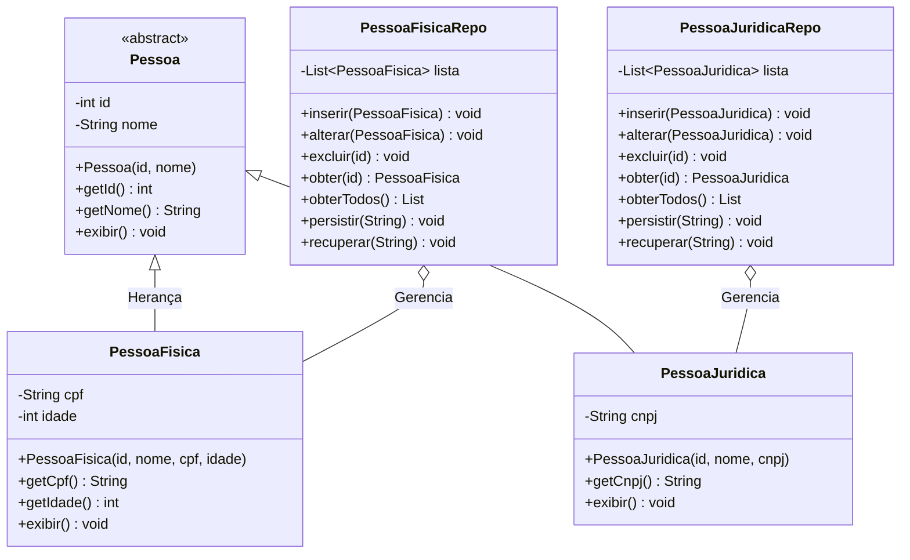

# ☕ Java POO & Binary Persistence

<div align="center">
  
  
  
  
</div>

---

Este projeto é um sistema cadastral desenvolvido em **Java** para console que demonstra de forma prática os conceitos fundamentais de **Programação Orientada a Objetos (POO)** e a **serialização de dados em arquivos binários**. 

Ele foi criado como trabalho prático avaliativo (Missão Prática) para a faculdade **Estácio de Sá** no **3º Período** do curso de desenvolvimento de software.

---

## 🎨 Pilares de POO Demonstrados

- **Herança:** A classe abstrata base `Pessoa` é herdada por `PessoaFisica` (adicionando atributos como CPF e Idade) e `PessoaJuridica` (adicionando CNPJ).
- **Polimorfismo:** Implementado na sobreescrita de métodos específicos de exibição (`exibir()`) e na lógica genérica de repositório.
- **Encapsulamento:** Todos os atributos das classes de modelo são privados (`private`) e acessados com segurança por métodos getters/setters.
- **Abstração:** A classe principal `Pessoa` é definida como abstrata, servindo como molde estrutural sem permitir instanciamento direto.

---

## 📐 Diagrama de Classes e Arquitetura

O sistema é estruturado utilizando classes de modelo e classes de controle (Repositórios) que gerenciam a entrada/saída de dados de forma independente:



---

## 💾 Persistência de Dados Binários

Em vez de utilizar bancos de dados relacionais tradicionais, o projeto demonstra o uso de **Serialização nativa do Java** para persistir o estado completo das listas de objetos em arquivos binários locais:
*   Os dados são gravados permanentemente nos arquivos `pessoas_fisicas.dat` e `pessoas_juridicas.dat` utilizando as classes `FileOutputStream` e `ObjectOutputStream`.
*   A leitura de recuperação é feita com `FileInputStream` e `ObjectInputStream`, reconstruindo as listas de objetos em memória ao iniciar o aplicativo.

---

## 📂 Estrutura das Pastas

```bash
/
├── src/
│   ├── Main.java      # Classe de entrada e menu de console interativo
│   └── model/
│       ├── Pessoa.java          # Classe abstrata base
│       ├── PessoaFisica.java    # Modelo de Pessoa Física
│       ├── PessoaJuridica.java  # Modelo de Pessoa Jurídica
│       ├── PessoaFisicaRepo.java    # Repositório de persistência de PF
│       └── PessoaJuridicaRepo.java  # Repositório de persistência de PJ
├── pessoas_fisicas.dat    # Arquivo binário de dados de PF
├── pessoas_juridicas.dat   # Arquivo binário de dados de PJ
├── CadastroPOO.iml        # Arquivo de módulo do IntelliJ IDEA
└── Relatorio...pdf        # Relatório técnico explicativo do projeto
```

---

## 🚀 Como Executar

Por ser uma aplicação baseada em console interativo de terminal, ela não possui dependências complexas:

1. Abra a pasta raiz em qualquer IDE Java (IntelliJ IDEA, Eclipse, NetBeans).
2. Execute o arquivo `src/Main.java`.
3. Interaja com o menu no console para cadastrar, exibir, alterar ou persistir dados.